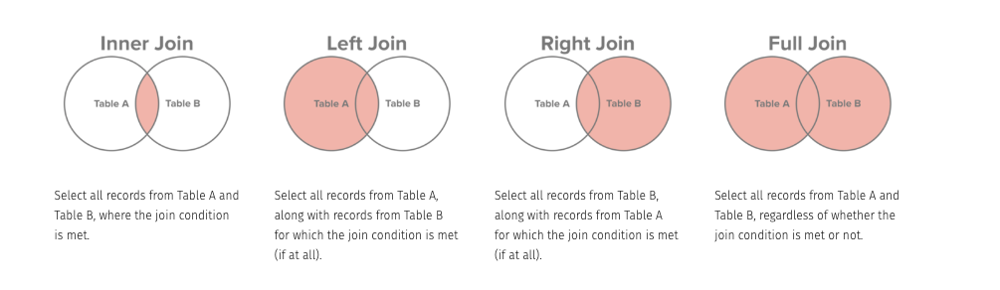

<h1>
  <span class="headline">SQL Joins</span>
  <span class="subhead">Joins</span>
</h1>

**Learning objective:** By the end of this lesson, students will be able to leverage joins to construct advanced queries that retrieve and analyze data from multiple relational tables.

## Joins

Looking at our two tables separately doesn't really help us figure out what is going on. We want to be able to join our data together.

There are many ways to join data. A great way to start visualizing the different types of joins is with [Venn Diagrams](http://www.sql-join.com/sql-join-types)



**Caveat**: Many people don't like using Venn Diagrams to demonstrate joins as they are not totally accurate as to what is actually happening. There are other visualizations out there, but they are not as simple as the Venn Diagrams.
See also: [more accurate representation of joins](https://blog.jooq.org/2016/07/05/say-no-to-venn-diagrams-when-explaining-joins/)

Let's look at the ice cream being produced at plants

```sql
SELECT * FROM ice_creams JOIN plants ON plants.ice_cream_id = ice_creams.id;
```

(press q to quit out of the data view and get your prompt back)

Ok, let's look at all the ice creams, whether or not they are at a plant

```sql
SELECT * FROM ice_creams LEFT JOIN plants ON plants.ice_cream_id = ice_creams.id;
```

Let's see all the plants, whether or not they are producing any ice cream

```sql
SELECT * FROM ice_creams RIGHT JOIN plants ON ice_creams.id = plants.ice_cream_id;
```

Let's see ALL the things.

We'll see our once ice cream that's not being produced anywhere and we can see all of our plants that do not yet have a flavor to produce.

```sql
SELECT * FROM ice_creams FULL OUTER JOIN plants ON ice_creams.id = plants.ice_cream_id;
```

We're seeing a lot of extra info. We can just see the ice creams and cities by altering our query

```sql
SELECT name, city FROM ice_creams FULL OUTER JOIN plants ON ice_creams.id = plants.ice_cream_id;
```

Finally, let's look at every combination, with a cross join:

```sql
SELECT * FROM ice_creams CROSS JOIN plants; -- wow that's every row from one table multiplied by the row of every table!
```

We can use what we've previously learned to handle our budding business.

We finally have a marketing person! They have decided that each flavor will be renamed to the city of where it was first manufactured.

So `Plain` will now be called `The Stamford`.
We'll give our ice cream two names. The `name` will be the primary marketing name. The `description` will be our old name.

Our Vanilla just won an award for `most provocative ice cream flavor of the year`! Let's give that one a name and get it into production and name it 'The Signature Connecticut'

Chocolate is still being tested by focus groups and is not yet ready for mass production.

```sql
ALTER TABLE ice_creams ADD COLUMN description TEXT;
-- update Plain to The Stamford
UPDATE ice_creams SET name = 'The Stamford', description = 'Plain' WHERE name = 'Plain';
-- update Blueberry to The Bridgeport
UPDATE ice_creams SET name = 'The Bridgeport', description = 'Blueberry' WHERE name = 'Blueberry';
-- update Strawberry to The Danbury
UPDATE ice_creams SET name = 'The Danbury', description = 'Strawberry ' WHERE name = 'Strawberry';
-- update Peanut butter to The Fairfield
UPDATE ice_creams SET name = 'The Fairfield', description = 'Peanut Butter' WHERE name = 'Peanut Butter';
-- update Vanilla to The Signature Connecticut
UPDATE ice_creams SET name = 'The Signature Connecticut', description = 'Vanilla' WHERE name = 'Vanilla';
```

Even though we made significant updates, our previous queries are still accurate.

```sql
SELECT city, name, description FROM ice_creams FULL OUTER JOIN plants ON ice_creams.id = plants.ice_cream_id;
```

## Average pints & berry recalls

We can build out more advanced queries using what we've learned previously.

For example, what if we wanted to know the average number of pints being made of our signature `The Danbury`?

```sql
SELECT
  AVG(pints)
FROM
  plants
INNER JOIN
  ice_creams
ON
 plants.ice_cream_id = ice_creams.id
WHERE
  name = 'The Danbury';
```

Or what if there is a recall on all berries! We need to find all the plants that are using berries!

```sql
SELECT
  city
FROM
  plants
INNER JOIN
  ice_creams
ON
 plants.ice_cream_id = ice_creams.id
WHERE description LIKE '%berry%';
```

## 🎓 You do: Write a query

Write a query that will show all the cities that have not `passed` inspection
